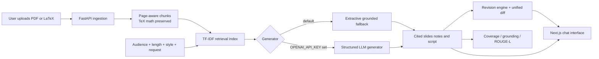

# SARAL Chatbot Prototype

An audience-adaptive, retrieval-augmented chatbot for turning research papers into cited slide bullets, speaker notes, and scripts. It demonstrates the assignment flow:

> Upload a paper → retrieve evidence → create a tailored deck/script → revise one slide → inspect the visible delta and provenance.

The app works without an API key through a deterministic extractive fallback. If `OPENAI_API_KEY` is supplied, it uses an optional structured-output LLM path for more natural narration, while still attaching an evidence citation to every generated item.

## Features

- PDF, LaTeX, Markdown, and text ingestion. LaTeX display-math blocks remain intact during chunking.
- Sparse retrieval with TF-IDF, which needs no paid service or model download.
- Audience, length, and style controls for policymakers, graduate students, press, and the general public.
- Slide bullets, three speaker notes per slide, and a 30-second, 90-second, or five-minute script.
- Per-claim provenance: every bullet, note, and script item shows its retrieved chunk ID and source page.
- Iterative editing with a focused “make slide #2 less technical” flow, a before/after unified diff, and an explanation of what was retained.
- Built-in evaluation endpoint for citation coverage, lexical grounding, and optional ROUGE-L against a supplied human reference script.

## Architecture



## Run it locally

You need Python 3.11+ and Node.js 20+.

### Start the API

From the project root:

```powershell
cd backend
python3 -m venv env
source env/bin/activate
pip install -r requirements.txt
uvicorn app.main:app --reload --port 8000
```

The API is at `http://localhost:8000`; `http://localhost:8000/docs` provides interactive API documentation.

### Start the interface

Open a second terminal at the project root:

```powershell
cd frontend
npm install
npm run dev
```

Open `http://localhost:3000`.

### Demo steps

1. Upload a short academic PDF or `.tex` paper. A ready-to-use sample is `backend/tests/fixtures/sample_paper.tex`.
2. Keep the default brief, or choose a different audience, style, or length.
3. Select **Generate cited draft**. Hover a citation tag such as `C1-2 · p.1` to read its evidence excerpt.
4. Ask **“Make this less technical and more accessible.”** for slide 2. The revised text and before/after diff appear beneath the form.
5. Capture this browser flow and the conversation-log endpoint as evidence for the assignment.

## Optional LLM providers

The fallback works without credentials. To activate an optional LLM provider (Google AI / Gemini or OpenAI), set the key before starting the backend, or select the provider and enter your key in the web interface:

### Google AI (Gemini)
```powershell
$env:GEMINI_API_KEY = "your-google-ai-api-key"
# or $env:GOOGLE_API_KEY = "your-google-ai-api-key"
$env:GEMINI_MODEL = "gemini-1.5-flash"  # optional override
uvicorn app.main:app --reload --port 8000
```

### OpenAI
```powershell
$env:OPENAI_API_KEY = "your-key"
$env:OPENAI_MODEL = "gpt-4.1-mini"  # optional override
uvicorn app.main:app --reload --port 8000
```

Providers are isolated in `backend/app/generation.py` with automatic evidence grounding and source citation verification.

## Docker option

With Docker Desktop running:

```powershell
docker compose up --build
```

Then visit `http://localhost:3000`.

## Tests

From `backend` with the virtual environment active:

```powershell
pip install pytest
pytest
```

The tests check that every output claim has a citation, LaTeX is ingested, and a revision produces a visible delta.

## Evaluation plan

The assignment asks for three papers and human evaluation. Use this procedure:

1. Select three openly licensed, small conference papers containing prose and an equation.
2. Create one short human-authored reference script for each target output.
3. Generate each condition and save the API JSON response.
4. Call `POST /api/evaluate` with the `document_id`, `run_id`, and `reference_script`. Record citation coverage, lexical grounding, and ROUGE-L.
5. Ask three raters to score factuality, audience appropriateness, and helpfulness from 1–5. Blind the system name if feasible.
6. Report averages, per-paper results, and one failure example. Treat lexical overlap and ROUGE as proxies, not proof of factuality.

Example evaluation body:

```json
{
  "document_id": "<document-id>",
  "run_id": "<run-id>",
  "reference_script": "A human-authored reference script goes here."
}
```

## Submission checklist

- [ ] Record a 2–3 minute UI demo: upload, generate, inspect citations, revise slide 2, show the diff.
- [ ] Include the architecture diagram and this README in the GitHub repository.
- [ ] Include saved input/output JSON for three papers and an evaluation table.
- [ ] Document every external model, API, paper, and code resource used.
- [ ] Prepare the separate five-minute RAG-paper video and one-page retrieval/chunking/prompt plan required by Part B.

## Limitations and next steps

This is deliberately a prototype. Its index and conversation state are in memory, and its default generator is extractive to remain reliable without credentials. A production version would add persistent object storage and a vector database, authentication and tenant isolation, async ingestion jobs, safety moderation, observability, caching, and user-feedback storage. PDFs usually cannot preserve original LaTeX exactly, so use a `.tex` source when equation fidelity is essential.

